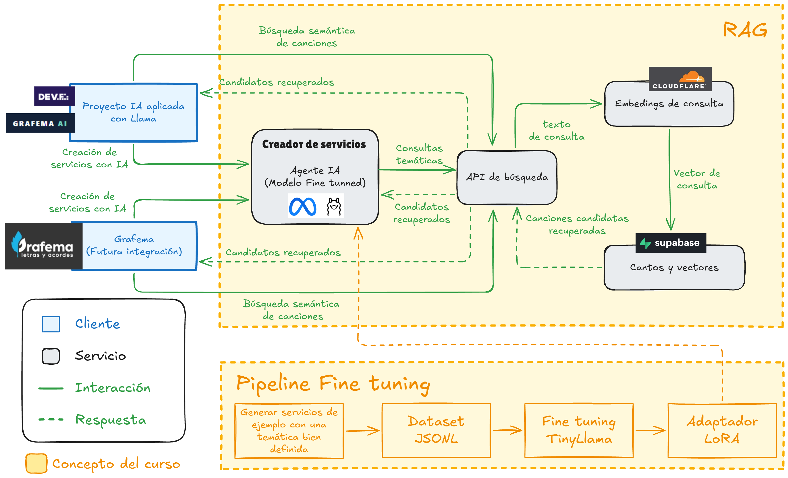

# Grafema AI - **Proyecto del curso de IA aplicada con Llama**

  
  &nbsp;&nbsp;&nbsp;
  

<h1 align="center">Grafema AI</h1>

<strong>Búsqueda semántica y asistencia con Llama para un catálogo de cantos cristianos.</strong>

  Proyecto final del módulo <em>IA Aplicada con Modelos Abiertos</em> · DEV.F + Meta 
  <a href="https://grafema-ai.vercel.app/"><strong>Visitar la demostración pública →</strong></a>
  &nbsp;·&nbsp;
  
   
   
<a href="https://huggingface.co/JaredRamirezDiaz/grafema-tinyllama-servicios">Link al modelo fine-tunned (HF)</a>

## Contexto

**Grafema Presenter** es un proyecto personal que desarrollo para apoyar a mi iglesia para gestión de cantos y servicios, así como en la presentación de letras. Actualmente contamos con un catálogo de aproximadamente 500–600 cantos, el cual ofrece un caso real para aplicar lo aprendido en el curso: modelos Llama, prompts, embeddings, RAG, ajuste fino y evaluación.

El problema elegido es encontrar cantos pertinentes a una necesidad expresada en lenguaje natural. Por ejemplo: «Busco cantos sobre la esperanza para iniciar un servicio». La búsqueda debe considerar el significado de la letra y el contexto del servicio, además de las palabras del título.

## Proyecto (Hackaton)

El entregable es un **sitio público de demostración llamado "Grafema AI"** : cualquier Sensei podrá abrir la URL, escribir una solicitud y explorar las recomendaciones con un catálogo precargado, sin necesidad de crear una cuenta ni preparar canciones. También podrá utilizar un Agente de IA (impulsado por un LLM + adaptador LoRA) especializado en generar propuestas de servicios (listas de cantos) tomando cómo base una temática.

**"Grafema AI"** es un frontend estático que consume una API independiente. Esta separación permitirá conectar posteriormente el mismo servicio con Grafema Presenter.

## Tecnologías y despliegue

| Componente | Tecnología | Uso en el proyecto |
| --- | --- | --- |
| Front End | Vite, React y TypeScript; despliegue en Vercel | Formulario, resultados y comparación de variantes; compilación estática. |
| API | Python y FastAPI; despliegue gratuito en Render | Endpoint `/search`, coordinación de RAG y conexión a servicios cómo Supabase y Cloudflare AI Workers (ambos con capa gratuita). |
| Datos | Supabase PostgreSQL + extensión `pgvector` | Catálogo precargado, metadatos y embeddings asociados a cada canto. |
| Embeddings | `@cf/baai/bge-m3` en Cloudflare Workers AI | Representación multilingüe de letras y consultas en español. |
| Generación de servicios con IA | `@cf/meta/llama-3.2-3b-instruct` en Cloudflare Workers AI + adaptador LoRA | Interpretación de la solicitud y explicación basada en los cantos recuperados. |
| Ajuste fino | Google Colab + LoRA; inferencia con adaptador en Workers AI | Ajuste fino al modelo TinyLlama para especializarlo en creación de servicios con base en una temática bien definida. |

La API de búsqueda recibie la consulta, genera su embedding, busca los cantos relevantes en Supabase y envía **solo esos candidatos** a Llama. A su vez Llama analiza los candidatos y selecciona los cantos que encajan en el servicio considerando la letra pero también el nivel de energía y el tiempo del servicio. 

**Límites de la demo gratuita:** Render suspende la API tras 15 minutos de inactividad y el primer acceso puede tardar cerca de un minuto; sus archivos locales no sirven como almacenamiento persistente. Supabase puede pausar proyectos gratuitos con poca actividad durante una semana. Workers AI tiene una cuota gratuita diaria; al agotarse, las solicitudes fallarán hasta el reinicio de la cuota y la inferencia con adaptadores LoRA de Workers AI está en beta.

## Aplicación real y siguientes pasos

Este proyecto sirve cómo prueba de concepto en un contexto real. Para que en un futuro esta funcionalidad sea integrada en la aplicación de Grafema Presenter.

### Referencias técnicas

- [Render: servicios gratuitos](https://render.com/docs/free) · [Supabase: `pgvector`](https://supabase.com/docs/guides/database/extensions/pgvector) y [plan gratuito](https://supabase.com/pricing).
- [Workers AI: modelos y precios](https://developers.cloudflare.com/workers-ai/platform/pricing/) · [Llama 3.2 3B](https://developers.cloudflare.com/workers-ai/models/llama-3.2-3b-instruct/) · [adaptadores LoRA](https://developers.cloudflare.com/workers-ai/features/fine-tunes/loras/).
