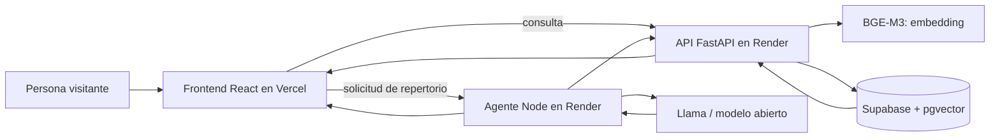

<p align="center">
  
  &nbsp;&nbsp;&nbsp;
  
  &nbsp;&nbsp;&nbsp;
  
</p>

<h1 align="center">Grafema AI</h1>

<p align="center"><strong>Búsqueda semántica y asistencia con Llama para un catálogo de cantos cristianos.</strong></p>

<p align="center">
  Proyecto final del módulo <em>IA Aplicada con Modelos Abiertos</em> · DEV.F + Meta<br />
  <a href="https://grafema-ai.vercel.app/"><strong>Visitar la demostración pública →</strong></a>
  &nbsp;·&nbsp;
  <a href="https://github.com/JaredRamirezDiaz/Grafema-AI"></a>
</p>

> [!NOTE]
> Los logotipos incluidos en `docs/assets/` son marcadores temporales. Pueden sustituirse por los archivos oficiales conservando los mismos nombres.

## El contexto, explicado desde cero

**Grafema Presenter** es un proyecto personal creado para apoyar el trabajo musical de una iglesia cristiana. Su catálogo reúne aproximadamente 550 cantos con sus letras y metadatos.

En una iglesia cristiana, un **culto** o **servicio** es una reunión comunitaria que puede incluir enseñanza, oración y música. Los cantos no se eligen únicamente por su título: se consideran el mensaje de la letra, el momento de la reunión, el tono emocional, la facilidad para cantarlo en comunidad y el tema que se desea comunicar.

Por ejemplo, una persona podría necesitar:

- un canto de esperanza para una comunidad que atraviesa dificultades;
- una letra de gratitud para comenzar una reunión;
- cantos sobre la resurrección de Jesús;
- una secuencia que avance de un momento celebrativo a uno reflexivo.

Encontrar buenas opciones dentro de cientos de letras requiere tiempo y conocimiento del catálogo. Una búsqueda tradicional por palabras exactas puede fallar cuando la consulta y la letra expresan la misma idea con vocabulario diferente.

## ¿Qué problema resuelve Grafema AI?

Grafema AI demuestra cómo usar modelos abiertos para **recuperar información por significado y presentar evidencia verificable**.

La aplicación ofrece dos experiencias públicas:

1. **Buscador semántico:** recibe una necesidad en lenguaje natural, genera un embedding y recupera cantos y secciones relacionados por su contenido.
2. **Agente de repertorios:** recibe un tema, una ocasión y un recorrido de energía; consulta el catálogo y propone una secuencia editable con motivos para cada elección.

La IA no sustituye la decisión humana ni determina qué debe cantar una comunidad. Reduce el espacio de búsqueda y hace visibles letras, secciones y etiquetas para que una persona pueda revisar la propuesta.

## Relación con el curso

Este repositorio es el entregable del Hackathon 1 del curso **IA Aplicada con Modelos Abiertos**. Integra los conceptos principales del módulo:

| Aprendizaje | Aplicación en Grafema AI |
| --- | --- |
| Modelos de lenguaje abiertos | Llama interpreta una solicitud y explica una propuesta limitada a candidatos reales. |
| Prompt engineering | Los mensajes definen formato, restricciones e IDs permitidos para reducir respuestas inventadas. |
| RAG | El sistema recupera primero cantos del catálogo y después entrega ese contexto al modelo. |
| Embeddings | BGE-M3 representa consultas, cantos y secciones en un espacio vectorial multilingüe. |
| Evaluación | Un benchmark temático permite comparar recuperación semántica con métodos anteriores. |
| Fine-tuning con LoRA | El proyecto prepara borradores revisables para una futura especialización; el ajuste no se presenta como requisito para usar la demo actual. |
| Despliegue end-to-end | React, FastAPI, Supabase y servicios de inferencia se integran mediante endpoints públicos. |

## Cómo funciona



### Flujo del buscador

1. La persona describe lo que necesita con lenguaje cotidiano.
2. FastAPI normaliza la consulta y genera su embedding BGE-M3.
3. Supabase busca los cantos y las secciones más cercanas con `pgvector`.
4. El ranking combina similitud semántica con etiquetas de tema, carácter, momento y energía.
5. La interfaz muestra resultados, fragmentos coincidentes y la letra completa para revisión.

### Flujo del agente

1. La persona indica tema, enfoque, ocasión, cantidad de cantos y recorrido de energía.
2. El agente divide la solicitud en momentos y consulta la API de búsqueda.
3. El modelo recibe solamente candidatos recuperados y debe elegir IDs válidos sin repetirlos.
4. La interfaz presenta el orden sugerido, sus motivos y alternativas editables.

## Qué contiene la demostración

- Consulta libre en español, sin registro ni carga de archivos.
- Búsqueda sobre aproximadamente **550 cantos** y **2,040 secciones**.
- Evidencia por fragmento de letra y etiquetas del catálogo.
- Propuesta asistida de repertorios con varios modelos configurables en servidor.
- Estados de espera claros para el arranque en frío de Render.
- Diagnóstico de errores por etapa, endpoint e identificador de traza.
- Diseño adaptable para escritorio y dispositivos móviles.

Las herramientas internas para generación por lotes, revisión administrativa y exportación de datasets no forman parte de la navegación pública de la entrega.

## Tecnologías

| Capa | Tecnología | Responsabilidad |
| --- | --- | --- |
| Interfaz | React 19, TypeScript, Vite y componentes con patrón shadcn/ui | Experiencia pública, navegación, búsqueda y revisión de propuestas. |
| API de búsqueda | Python y FastAPI | Validación, embeddings, recuperación y ranking. |
| Agente | Node.js, Vercel AI SDK y Zod | Orquestación de herramientas, validación y streaming de progreso. |
| Datos | Supabase PostgreSQL + `pgvector` | Catálogo, etiquetas, secciones y vectores. |
| Embeddings | `BAAI/bge-m3` | Representación semántica multilingüe de letras y consultas. |
| Generación | Modelos Llama/OpenRouter configurados en servidor | Selección explicada entre candidatos recuperados. |
| Despliegue | Vercel + Render | Frontend estático y servicios independientes. |

## Estructura del repositorio

```text
Grafema AI/
├── api/
│   ├── app/                 # FastAPI, embeddings, recuperación y ranking
│   ├── scripts/             # Importación, embeddings y evaluación
│   ├── sql/                 # Esquema, funciones vectoriales y migraciones
│   └── tests/               # Pruebas del pipeline de búsqueda
├── data/                    # Catálogo procesado, etiquetas y benchmarks
├── docs/assets/             # Logos y recursos del README
├── web/
│   ├── api/                 # Endpoints del agente y persistencia
│   ├── src/                 # Buscador, agente, información y componentes
│   └── tests/               # Pruebas de selección y validación del agente
├── DiagramaProyectoLlama.png
└── README.md
```

## Ejecución local

### Requisitos

- Node.js 20 o superior.
- Python 3.11 o superior.
- Un proyecto Supabase con las migraciones de `api/sql/`.
- Credenciales del proveedor de embeddings y, para el agente, de un modelo generativo.

### 1. API de búsqueda

```bash
cd api
python -m venv .venv
# Windows: .venv\Scripts\activate
# macOS/Linux: source .venv/bin/activate
pip install -r requirements.txt
uvicorn app.main:app --reload --port 8000
```

Crea `api/.env` con las variables necesarias. Nunca publiques este archivo:

```dotenv
SUPABASE_URL=https://TU-PROYECTO.supabase.co
SUPABASE_SECRET_KEY=sb_secret_...
CLOUDFLARE_ACCOUNT_ID=
CLOUDFLARE_API_TOKEN=
CORS_ORIGINS=http://localhost:5173
```

### 2. Frontend y agente

```bash
cd web
npm install
npm run dev:agent   # terminal 1, puerto 8787
npm run dev         # terminal 2, puerto 5173
```

Copia `web/.env.example` como `web/.env.local` y configura las URLs y credenciales de servidor. Las variables `VITE_*` son públicas; las claves secretas nunca deben llevar ese prefijo.

Abre `http://localhost:5173`.

## Pruebas

```bash
# Frontend y agente
cd web
npm run build
npm run test:agent

# API
cd ../api
python -m unittest discover -s tests -v
```

## Despliegue de la demo

- **Frontend:** Vercel, usando `web/` como Root Directory, `npm run build` como build command y `dist` como output.
- **API de búsqueda:** Render con `uvicorn app.main:app --host 0.0.0.0 --port $PORT`.
- **Agente:** Render con `npm run dev:agent`; el proceso respeta automáticamente el puerto `PORT` de la plataforma.

Variables públicas del frontend:

```dotenv
VITE_API_URL=https://TU-API.onrender.com
VITE_AGENT_URL=https://TU-AGENTE.onrender.com
```

El agente debe autorizar tanto el dominio de Vercel como el entorno local:

```dotenv
AGENT_ALLOWED_ORIGINS=http://localhost:5173,https://TU-PROYECTO.vercel.app
GRAFEMA_API_URL=https://TU-API.onrender.com
```

## Evaluación y límites

- El benchmark incluido mide recuperación de cantos relevantes para consultas temáticas; no sustituye una evaluación pastoral o musical.
- Las etiquetas son probabilidades calculadas sobre las letras y deben interpretarse como evidencia auxiliar.
- Los modelos generativos pueden producir motivos imprecisos; la interfaz mantiene visibles las letras para facilitar su verificación.
- Los servicios gratuitos de Render pueden entrar en reposo. La primera solicitud puede tardar mientras el proceso vuelve a iniciar.
- Las letras pueden estar sujetas a permisos de uso; un despliegue real debe revisar licencias y políticas de acceso.

## Evolución hacia Grafema Presenter

La demo valida la arquitectura antes de integrarla en el producto real. La evolución prevista es:

1. evaluar resultados con personas que conocen el catálogo y documentar errores;
2. construir un conjunto de ejemplos revisados, separado entre entrenamiento y evaluación;
3. comparar prompting, RAG y un eventual adaptador LoRA con métricas reproducibles;
4. integrar la búsqueda como ayuda opcional dentro de Grafema Presenter;
5. añadir autenticación, permisos, observabilidad y trazabilidad antes de un uso real.

## Créditos

Proyecto académico desarrollado para el módulo **IA Aplicada con Modelos Abiertos**, dentro de la colaboración educativa de **DEV.F y Meta**, a partir de una necesidad real identificada en **Grafema Presenter**.

La responsabilidad de seleccionar y utilizar los cantos permanece siempre en las personas que conocen a su comunidad.
